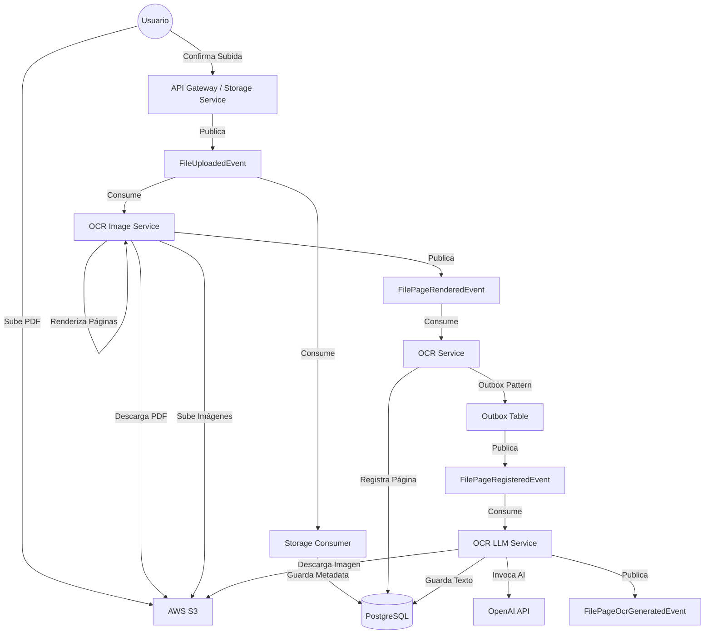

# 🚀 EDA Workshop: Sistema de OCR Distribuido

Este proyecto ha sido construido con fines educativos para demostrar en la práctica cómo implementar una **Arquitectura Orientada a Eventos (EDA)**, destacando sus beneficios y desafíos.

El sistema es una plataforma de procesamiento de documentos que permite subir archivos PDF, los cuales son procesados asíncronamente para extraer imágenes de cada página y realizar OCR (Reconocimiento Óptico de Caracteres) utilizando Inteligencia Artificial.

## 🏗️ Arquitectura del Sistema

El sistema está compuesto por varios microservicios desacoplados que se comunican principalmente a través de eventos utilizando **NATS JetStream**.

### Diagrama de Flujo de Eventos



### Componentes Principales

1.  **Frontend (React + Vite):** Interfaz de usuario para subir archivos y visualizar el estado del procesamiento.
2.  **Storage Service:** Gestiona la subida de archivos (Presigned URLs) y almacena los metadatos iniciales.
3.  **OCR Image Service:** Responsable de dividir el PDF en imágenes individuales por página.
4.  **OCR Service:** Orquestador central del dominio de OCR. Registra las páginas y gestiona el estado. Implementa el **Outbox Pattern** para garantizar la consistencia.
5.  **OCR LLM Service:** Utiliza Modelos de Lenguaje (LLM) para extraer y limpiar el texto de las imágenes.
6.  **NATS JetStream:** Bus de eventos que garantiza la entrega y persistencia de los mensajes.

## 💡 Patrones y Conceptos Clave

Este proyecto ilustra varios conceptos avanzados de EDA:

### 1. Comunicación Asíncrona y Desacoplamiento

Los servicios no se llaman directamente entre sí (HTTP/gRPC síncrono) para el flujo principal. En su lugar, producen eventos. Esto permite que `OCR Image Service` no necesite saber quién va a procesar las imágenes, solo notifica que "una página ha sido renderizada".

### 2. Fan-out

El evento `FileUploadedEvent` es consumido por dos servicios diferentes con propósitos distintos:

- **Storage Consumer:** Para persistir los metadatos en la base de datos.
- **OCR Image Service:** Para iniciar el proceso de renderizado.

### 3. Transactional Outbox Pattern

En el servicio `OCR`, necesitamos guardar el estado en la base de datos Y publicar un evento. Si hacemos esto en dos pasos separados y uno falla, el sistema queda inconsistente.
El proyecto utiliza el **Outbox Pattern**:

1.  Se inicia una transacción de base de datos.
2.  Se guarda el estado de la página.
3.  Se inserta el evento en una tabla `outbox_events` en la misma transacción.
4.  Un proceso separado (`OutboxProcessor`) lee de la tabla y publica en NATS de manera segura.
    - _Nota:_ El procesador utiliza `LISTEN/NOTIFY` de PostgreSQL para reaccionar casi instantáneamente a nuevos eventos, minimizando la latencia.

### 4. Escalabilidad Horizontal

Gracias a NATS y los grupos de consumidores (Consumer Groups), podemos levantar múltiples instancias de `ocr-image` o `ocr-llm` para procesar archivos en paralelo sin cambios en el código.

## ⚖️ Beneficios y Contras (EDA)

### ✅ Beneficios

- **Escalabilidad:** Cada parte del proceso puede escalar independientemente según la carga (ej. más workers para OCR si es el cuello de botella).
- **Resiliencia:** Si el servicio de LLM cae, los mensajes se acumulan en NATS y se procesan cuando vuelve a estar online. No se pierden datos.
- **Extensibilidad:** Podemos agregar un nuevo servicio que escuche `FileUploadedEvent` (ej. para generar miniaturas o auditoría) sin tocar los servicios existentes.

### ❌ Contras / Desafíos

- **Complejidad Operativa:** Requiere infraestructura adicional (Message Broker) y monitoreo distribuido.
- **Consistencia Eventual:** El usuario no ve los resultados inmediatamente. La UI debe manejar estados de "procesando" y actualizaciones asíncronas.
- **Depuración (Debugging):** Rastrear un error a través de múltiples servicios es difícil. Este proyecto utiliza **OpenTelemetry** para trazabilidad distribuida.

## 🛠️ Stack Tecnológico

- **Lenguaje:** Go 1.25
- **Frontend:** React, TypeScript, Vite, Fluent UI
- **Mensajería:** NATS JetStream
- **Base de Datos:** PostgreSQL
- **Almacenamiento:** AWS S3 (o compatible, ej. MinIO)
- **Infraestructura:** Kubernetes (k8s), Tilt
- **Observabilidad:** OpenTelemetry, Jaeger

## 📋 Prerrequisitos

Para ejecutar este proyecto, necesitas un entorno de Kubernetes local y la herramienta Tilt.

### 1. Kubernetes Cluster

El proyecto requiere un clúster de Kubernetes activo. Aquí tienes algunas recomendaciones según tu sistema operativo:

- **General (Windows/Linux/Mac):** [Rancher Desktop](https://rancherdesktop.io/) es una excelente opción todo en uno.
- **macOS:** [OrbStack](https://orbstack.dev/) es altamente recomendado por su ligereza y velocidad.
- **Linux (Sin interfaz gráfica / Servidores):** [K3D](https://k3d.io/) es ideal.
  - _Importante:_ Crea el clúster con un registry local para que Tilt funcione correctamente:
    ```bash
    k3d cluster create kubedev --registry-create kubedev-registry
    ```

### 2. Tilt

[Tilt](https://tilt.dev/) es la herramienta que utilizamos para orquestar el desarrollo de microservicios en Kubernetes. Se encarga de construir las imágenes, desplegarlas y mostrar los logs en tiempo real.

- Consulta la documentación oficial en [tilt.dev](https://tilt.dev/) para instalarlo.

## ⚙️ Configuración

Antes de levantar el proyecto, es necesario configurar algunas credenciales y parámetros.

### 1. Backend Config

El servicio de backend necesita credenciales para Telegram y el proveedor de LLM.

1.  Navega a `k8s.local/backend/config/`.
2.  Copia el archivo de ejemplo:
    ```bash
    cp k8s.local/backend/config/config.example.yaml k8s.local/backend/config/config.yaml
    ```
3.  Edita `k8s.local/backend/config/config.yaml` y establece los siguientes valores:
    - `telegram.bot_token`: Tu token de bot de Telegram.
    - `telegram.chat_id`: El ID del chat donde quieres recibir notificaciones.
    - `llm.api_key`: Tu API Key de OpenRouter (o proveedor compatible).
4.  Genera el ConfigMap de Kubernetes:
    ```bash
    cd k8s.local/backend
    make config
    ```

### 2. OCR LLM Config (Opcional)

Puedes personalizar los prompts y el modelo utilizado para el OCR.

1.  Edita el archivo `k8s.local/ocr-llm/config/prompts.yaml` si deseas cambiar el modelo (por defecto `qwen/qwen3-vl-8b-instruct`) o las instrucciones del sistema.
2.  Si realizas cambios, regenera el ConfigMap:
    ```bash
    cd k8s.local/ocr-llm
    make config
    ```

## 🚀 Cómo Ejecutar

El proyecto incluye un `Makefile` para facilitar la gestión del ciclo de vida de la aplicación.

### Comandos Disponibles

- **`make setup`**: Ejecuta scripts de configuración inicial (si es necesario).
- **`make up`**: Levanta todo el entorno utilizando **Tilt**. Crea el namespace `eda-workshop` si no existe.
  ```bash
  make up
  ```
- **`make stop`**: Detiene los servicios pero mantiene los volúmenes de datos (PVCs).
  ```bash
  make stop
  ```
- **`make down`**: ⚠️ **Destruye todo**, incluyendo los volúmenes de datos y el namespace. Úsalo para limpiar completamente el entorno.
  ```bash
  make down
  ```
- **`make clean`**: Limpia el sistema de Docker (imágenes no usadas, volúmenes huérfanos, etc.).

### Ejecución Típica

Para iniciar el taller, simplemente ejecuta:

```bash
make up
```

Esto abrirá la interfaz de Tilt en tu navegador, donde podrás ver el estado de todos los servicios.
