# 🚀 EDA Workshop: Sistema de OCR Distribuido

Este proyecto ha sido construido con fines educativos para demostrar en la práctica cómo implementar una **Arquitectura Orientada a Eventos (EDA)**, destacando sus beneficios y desafíos.

El sistema es una plataforma de procesamiento de documentos que permite subir archivos PDF, los cuales son procesados asíncronamente para extraer imágenes de cada página y realizar OCR (Reconocimiento Óptico de Caracteres) utilizando Inteligencia Artificial.

## 🏗️ Arquitectura del Sistema

El sistema está compuesto por varios microservicios desacoplados que se comunican principalmente a través de eventos utilizando **NATS JetStream**.

### Diagrama de Flujo de Eventos

```mermaid
graph TD
    User((Usuario)) -->|Sube PDF| S3[AWS S3]
    User -->|Confirma Subida| API[API Gateway / Storage Service]

    API -->|Publica| E1[FileUploadedEvent]

    E1 -->|Consume| StorageConsumer[Storage Consumer]
    StorageConsumer -->|Guarda Metadata| DB[(PostgreSQL)]

    E1 -->|Consume| OCRImage[OCR Image Service]
    OCRImage -->|Descarga PDF| S3
    OCRImage -->|Renderiza Páginas| OCRImage
    OCRImage -->|Sube Imágenes| S3
    OCRImage -->|Publica| E2[FilePageRenderedEvent]

    E2 -->|Consume| OCRService[OCR Service]
    OCRService -->|Registra Página| DB
    OCRService -->|Outbox Pattern| Outbox[Outbox Table]
    Outbox -->|Publica| E3[FilePageRegisteredEvent]

    E3 -->|Consume| OCRLLM[OCR LLM Service]
    OCRLLM -->|Descarga Imagen| S3
    OCRLLM -->|Invoca AI| OpenAI[OpenAI API]
    OCRLLM -->|Guarda Texto| DB
    OCRLLM -->|Publica| E4[FilePageOcrGeneratedEvent]
```



### Componentes Principales

1.  **Frontend (React + Vite):** Interfaz de usuario para subir archivos y visualizar el estado del procesamiento.
2.  **Storage Service:** Gestiona la subida de archivos (Presigned URLs) y almacena los metadatos iniciales.
3.  **OCR Image Service:** Responsable de dividir el PDF en imágenes individuales por página.
4.  **OCR Service:** Orquestador central del dominio de OCR. Registra las páginas y gestiona el estado. Implementa el **Outbox Pattern** para garantizar la consistencia.
5.  **OCR LLM Service:** Utiliza Modelos de Lenguaje (LLM) para extraer y limpiar el texto de las imágenes.
6.  **NATS JetStream:** Bus de eventos que garantiza la entrega y persistencia de los mensajes.

## 💡 Patrones y Conceptos Clave

Este proyecto ilustra varios conceptos avanzados de EDA:

### 1. Comunicación Asíncrona y Desacoplamiento

Los servicios no se llaman directamente entre sí (HTTP/gRPC síncrono) para el flujo principal. En su lugar, producen eventos. Esto permite que `OCR Image Service` no necesite saber quién va a procesar las imágenes, solo notifica que "una página ha sido renderizada".

### 2. Fan-out

El evento `FileUploadedEvent` es consumido por dos servicios diferentes con propósitos distintos:

- **Storage Consumer:** Para persistir los metadatos en la base de datos.
- **OCR Image Service:** Para iniciar el proceso de renderizado.

### 3. Transactional Outbox Pattern

En el servicio `OCR`, necesitamos guardar el estado en la base de datos Y publicar un evento. Si hacemos esto en dos pasos separados y uno falla, el sistema queda inconsistente.
El proyecto utiliza el **Outbox Pattern**:

1.  Se inicia una transacción de base de datos.
2.  Se guarda el estado de la página.
3.  Se inserta el evento en una tabla `outbox_events` en la misma transacción.
4.  Un proceso separado (`OutboxProcessor`) lee de la tabla y publica en NATS de manera segura.
    - _Nota:_ El procesador utiliza `LISTEN/NOTIFY` de PostgreSQL para reaccionar casi instantáneamente a nuevos eventos, minimizando la latencia.

### 4. Escalabilidad Horizontal

Gracias a NATS y los grupos de consumidores (Consumer Groups), podemos levantar múltiples instancias de `ocr-image` o `ocr-llm` para procesar archivos en paralelo sin cambios en el código.

## ⚖️ Beneficios y Contras (EDA)

### ✅ Beneficios

- **Escalabilidad:** Cada parte del proceso puede escalar independientemente según la carga (ej. más workers para OCR si es el cuello de botella).
- **Resiliencia:** Si el servicio de LLM cae, los mensajes se acumulan en NATS y se procesan cuando vuelve a estar online. No se pierden datos.
- **Extensibilidad:** Podemos agregar un nuevo servicio que escuche `FileUploadedEvent` (ej. para generar miniaturas o auditoría) sin tocar los servicios existentes.

### ❌ Contras / Desafíos

- **Complejidad Operativa:** Requiere infraestructura adicional (Message Broker) y monitoreo distribuido.
- **Consistencia Eventual:** El usuario no ve los resultados inmediatamente. La UI debe manejar estados de "procesando" y actualizaciones asíncronas.
- **Depuración (Debugging):** Rastrear un error a través de múltiples servicios es difícil. Este proyecto utiliza **OpenTelemetry** para trazabilidad distribuida.

## 🛠️ Stack Tecnológico

- **Lenguaje:** Go 1.25
- **Frontend:** React, TypeScript, Vite, Fluent UI
- **Mensajería:** NATS JetStream
- **Base de Datos:** PostgreSQL
- **Almacenamiento:** AWS S3 (o compatible, ej. MinIO)
- **Infraestructura:** Kubernetes (k8s), Tilt
- **Observabilidad:** OpenTelemetry, Jaeger

## 🚀 Cómo Ejecutar

El proyecto está configurado para ejecutarse localmente utilizando **Tilt**, que orquesta todo el entorno en un clúster de Kubernetes local (como Docker Desktop o Kind).

```bash
tilt up
```

Esto levantará:

- Base de datos PostgreSQL
- NATS
- Servicios de Backend
- Frontend
- Infraestructura de Observabilidad
