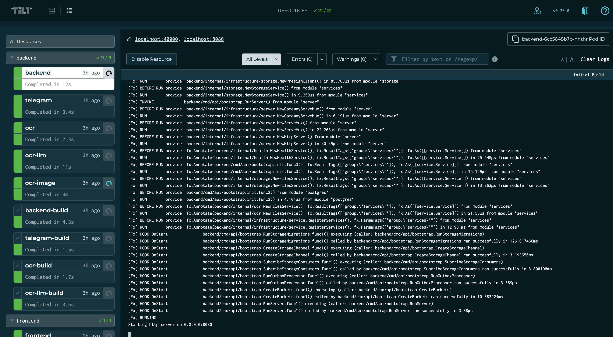
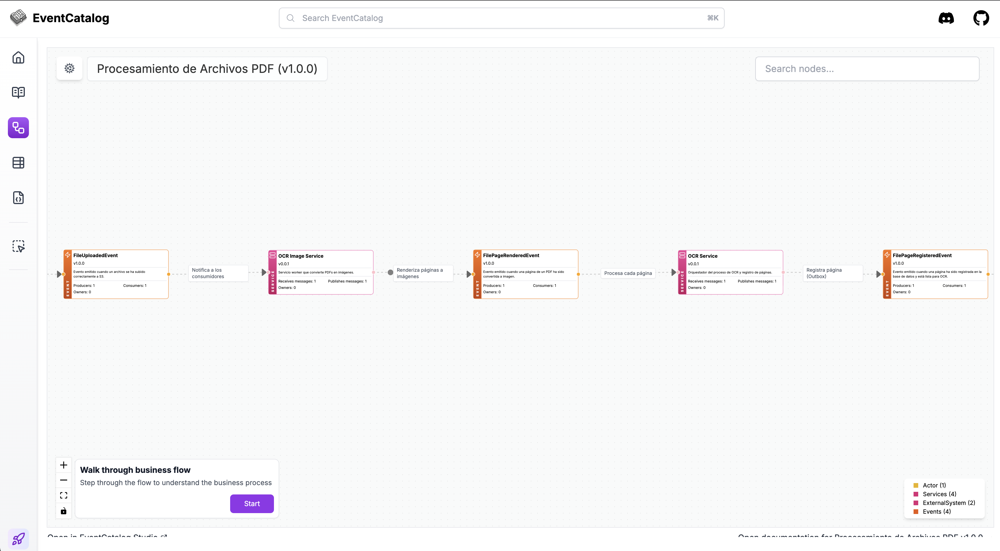
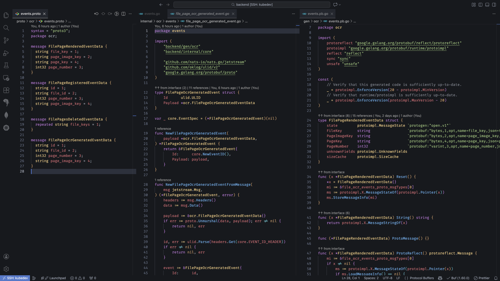
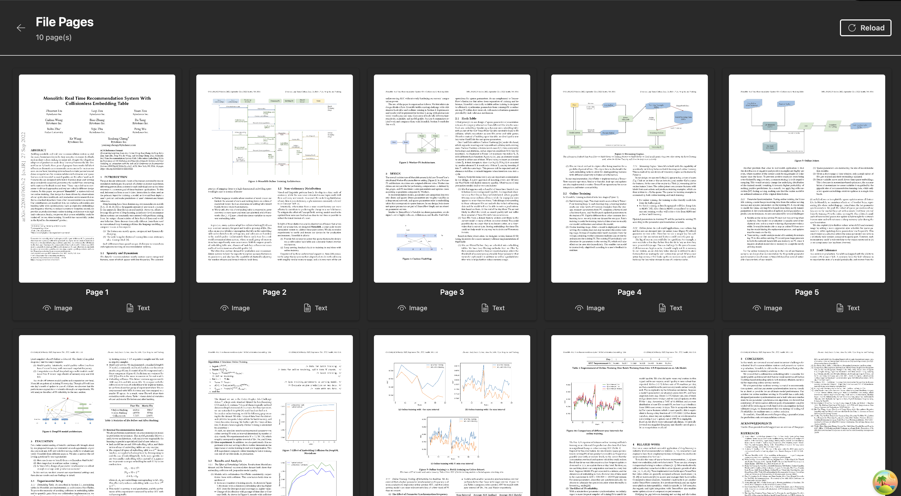
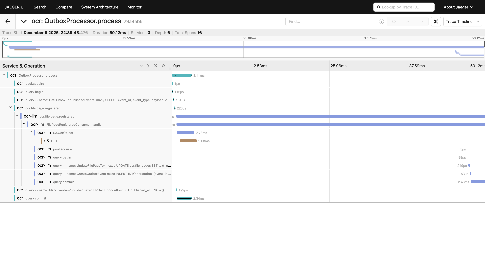
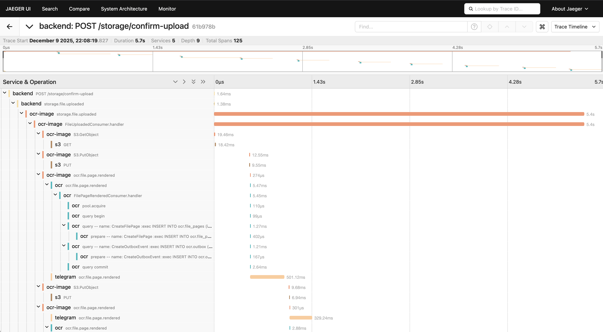

# 5 Días Construyendo un Sistema OCR Distribuido: Event Driven Architecture en la Práctica

**Luis Correa**  
💻 Computer Scientist | Solution Architect | Software Engineer

---

Llevaba meses hablando de Event Driven Architecture y Microservicios. Dando opiniones. Criticando implementaciones ajenas. Pero como decimos en la industria "Hablar es barato, show me the code."

He construido sistemas "Semi EDA" para algunas empresas, proyectos híbridos con arquitecturas mixtas. Pero todo en repositorios privados, invisible para el resto del mundo.

Decidí que era hora de cambiar eso. Construir algo público, funcional, que no se quedara en teoría ni en slides de PowerPoint. Un proyecto "de juguete" lo suficientemente serio como para demostrar patrones reales.

Así que me propuse un reto: construir un sistema de OCR distribuido. Subes un PDF, el sistema lo procesa en paralelo y te devuelve el texto extraído. Nada revolucionario. Pero hacerlo _bien_ -escalable, resiliente, observable- resultó ser un viaje fascinante por todo lo que está mal (y bien) con los sistemas distribuidos modernos.

El resultado es [EDA Workshop](https://github.com/luiscib3r/eda-workshop): 5 microservicios (yo les llamo nanoservicios), NATS JetStream, Postgres, Kubernetes, y suficiente complejidad operativa como para cuestionar todas mis decisiones de vida.

Este no es un tutorial paso a paso. Es la historia honesta de cómo lo construí, las decisiones que tomé, las que me arrepiento, y las herramientas que salvaron mi cordura.

---

## Episodio 0: El Infierno del "Localhost"

Antes de escribir una línea de lógica de negocio, me topé con el verdadero enemigo de los microservicios: **el entorno de desarrollo local**.

¿Cómo ejecutas 5 servicios de Go, Postgres, NATS, S3, y mantienes tu laptop sin explotar? Si tu respuesta es "10 pestañas de terminal con `go run`", déjame ahorrarte tiempo: no funciona. No a largo plazo.

### La Solución: Tilt

Terminé usando [Tilt](https://tilt.dev/). No es sexy. No tiene una página de marketing con gradientes violetas y promesas de "10x developer productivity". Es solo una herramienta que _funciona_.

Tilt observa tu código, reconstruye solo lo que cambió, y actualiza los contenedores en Kubernetes local (uso k3d) en segundos. Los logs de todos los servicios en una ventana. Las dependencias bien definidas (no levantes el backend hasta que Postgres esté listo).



```python
# Fragmento del Tiltfile
# ===========================================================
# OCR Image Service
# ===========================================================
docker_build(
    'ocr-image',
    context='./backend',
    dockerfile='k8s.local/Dockerfile.ocr',
)

k8s_yaml('k8s.local/ocr-image/deployment.yaml')
k8s_resource(
    'ocr-image',
    labels='backend',
    resource_deps=['ocr'],
    trigger_mode=TRIGGER_MODE_MANUAL,
)
```

**La parte honesta:** Tilt tiene una curva de aprendizaje. Kubernetes local puede ser pesado. Pero una vez configurado, el "inner loop" (código → build → test) es _increíblemente_ rápido. Cambio una función en Go, Tilt la recompila, actualiza el pod, y veo el resultado en menos de 5 segundos.

¿Vale la pena? Si vas a tener más de 3 servicios, absolutamente.

---

## Episodio 1: El Broker que No Quería Usar (NATS JetStream)

Necesitaba un message broker. Mi primera opción fue Kafka porque "es lo que usan las empresas grandes".

Luego recordé que Kafka requiere ZooKeeper (o KRaft), consume RAM como si estuviera en oferta, y tiene una curva de aprendizaje más empinada que aprender Haskell. Para este proyecto de OCR, era como usar un bulldozer para plantar una flor.

Así que elegí **NATS JetStream** por razones pragmáticas:

1. **Es un binario único** de ~30MB. No necesita Java, no necesita ZooKeeper, no necesita sacrificios a los dioses de la JVM.
2. **JetStream agrega persistencia** al core de NATS. Los mensajes sobreviven reinicios, los consumers pueden hacer replay, y tiene delivery guarantees decentes.
3. Creé algunas capas de abstracción para facilitarme la vida.

```go
// Publicar un evento
event := events.NewFileUploadedEvent(&storage.FileUploadedEventData{
    FileName: req.FileName,
    FileKey:  req.FileKey,
})
producer.Publish(ctx, event)
```



### La Abstracción que Salvó mi Sanidad

Para no repetir código de suscripción en cada servicio, creé un `NatsConsumer[T]` genérico en Go. Define tu handler, pasa el tipo de evento, y el consumer maneja todo el resto (ACKs, retries, graceful shutdown).

```go
consumer.NatsConsumer = nats.NewNatsConsumer(
		name,
		events.OCR_CHANNEL,
		events.FILE_PAGE_REGISTERED_EVENT,
		numWorkers,
		workerBufferSize,
		events.NewFilePageRegisteredEventFromMessage,
		consumer.handler,
		js,
		jetstream.ConsumerConfig{
			Name:          name,
			Durable:       name,
			Description:   "OCR File Page Registered Event Consumer",
			FilterSubject: events.FILE_PAGE_REGISTERED_EVENT,
			DeliverPolicy: jetstream.DeliverNewPolicy,
		},
)
consumer.Subscribe(ctx)
```

**La parte honesta:** NATS es genial para casos de uso como este. Pero si necesitas _exact-once delivery_ o particionamiento complejo como Kafka, estás frito. JetStream tiene _at-least-once_, lo que significa que tu código debe ser idempotente. Si no sabes qué significa eso, aprende antes de usar _cualquier_ message broker.

---

## Episodio 2: El Contrato Sagrado (Protobuf o el Caos)

En sistemas distribuidos, JSON es el equivalente a programar sin tests: funciona hasta que no funciona.

Un servicio envía `user_id`, otro espera `userId`. Boom. Runtime error en producción.

Decidí que **todo** se comunica con Protocol Buffers. No negociable.

### Buf: Protoc con Esteroides

Usar `protoc` directamente es como cocinar con utensilios oxidados. Funciona, pero sufres. [Buf](https://buf.build/) es la versión moderna:

1. **Linting estricto:** Si rompo compatibilidad backward, Buf me grita antes del commit.
2. **Generación unificada:** Un solo comando genera código Go, TypeScript para el frontend, y documentación OpenAPI.
3. **Registro remoto:** Puedes publicar tus schemas y compartirlos entre equipos.

```protobuf
// events.proto
message FilePageOcrGeneratedEventData {
  string id = 1;
  string file_id = 2;
  int32 page_number = 3;
  string page_image_key = 4;
}
```



Ejecuto `buf generate` y obtengo:

- Structs de Go con validación
- Swagger docs

**La parte honesta:** Protobuf agrega fricción inicial. Tienes que aprender la sintaxis, configurar Buf, y convencer a tu equipo de que "no, JSON no es suficiente". Pero el día que despliegas un cambio breaking y _el compilador te avisa antes de que llegue a producción_, entiendes por qué existe.

---

## Episodio 3: Fan-Out (o Cómo un Evento Dispara Múltiples Cosas)

Aquí es donde EDA empieza a brillar de verdad.

Cuando un usuario sube un archivo, publico un `FileUploadedEvent`. ¿Quién lo consume?

1. **Storage Consumer:** Guarda metadata en Postgres.
2. **OCR Image Service:** Descarga el PDF y lo convierte en imágenes.
3. **Audit Service** (futuro): Registra quién subió qué.

Ninguno de estos servicios sabe de la existencia del otro. El `Storage Service` no tiene idea de que hay un OCR downstream. Solo dice: "Archivo subido. Háganle lo que quieran."

```go
// Storage Service (productor)
event := events.NewFileUploadedEvent(
    &storage.FileUploadedEventData{
    	FileName: req.FileName,
    	FileKey:  req.FileKey,
    },
)

err := s.producer.Publish(ctx, event)

// OCR Image Service (consumidor 1)
func (c *FileUploadedConsumer) handler(
	ctx context.Context,
	event *events.FileUploadedEvent,
) error {
    // Descarga PDF, genera imágenes...
}

// Storage Consumer (consumidor 2)
func (c *FileUploadedConsumer) handler(
	ctx context.Context,
	event *events.FileUploadedEvent,
) error {
    // Guarda en DB la metadata del archivo...
}
```

**Escalabilidad gratis:** Si suben 100 PDFs, se pueden levantar más pods en Kubernetes (usando HPA) de `ocr-image`, NATS reparte la carga, y el sistema no suda.



**La parte difícil:** Fan-out es poderoso, pero puede convertirse en caos si no documentas qué servicios escuchan qué eventos. Por eso usé [EventCatalog](https://www.eventcatalog.dev/) para documentar cada evento, sus productores y consumidores. Sin documentación, un año después nadie recuerda por qué el servicio X escucha el evento Y.

---

## Episodio 4: El Fantasma de la Inconsistencia (Outbox Pattern al Rescate)

Aquí es donde los sistemas distribuidos te patean en la cara.

El `OCR Service` necesita:

1. Guardar en Postgres que la página X está lista.
2. Publicar un evento `FilePageRegisteredEvent` para que el LLM service la procese.

Si hago esto en dos pasos separados, tengo un problema:

- Guardo en DB, falla NATS → **Inconsistencia.** La DB dice "listo", pero nadie se enteró.
- Publico en NATS, falla la DB → **Inconsistencia.** El evento se disparó, pero no hay registro.

### Transactional Outbox Pattern

La solución: guardar el evento en una tabla `outbox_events` _dentro de la misma transacción_ de la base de datos.

```sql
-- Transacción atómica
BEGIN;
INSERT INTO file_pages (...) VALUES (...);
INSERT INTO outbox_events (event_type, payload) VALUES ('FilePageRegistered', ...);
COMMIT;
```



Luego, un proceso background (`OutboxProcessor`) lee la tabla y publica en NATS de forma segura.

### LISTEN/NOTIFY: Latencia Casi Cero

Para que no se sienta lento, uso `LISTEN/NOTIFY` de Postgres. La DB notifica al proceso Go _instantáneamente_ cuando hay un nuevo evento en la tabla. No polling cada 5 segundos como un animal.

```go
// Listen to outbox notifications
...
	_, err = conn.Exec(ctx, "LISTEN ocr_outbox_channel")
	if err != nil {
		return err
	}

	// Outbox notifications channel
	notifyChan := make(chan struct{})
	go func() {
		for {
			_, err := conn.Conn().WaitForNotification(ctx)
			if err != nil {
				if ctx.Err() != nil {
					return // Context canceled, exit
				}
				continue // Ignore errors and continue listening
			}
			notifyChan <- struct{}{}
		}
	}()

	// Initial backlog
	p.process(ctx)

	ticker := time.NewTicker(30 * time.Second)
	defer ticker.Stop()

	for {
		select {
		case <-notifyChan:
			p.process(ctx)
		case <-ticker.C:
			p.process(ctx)
		case <-ctx.Done():
			return ctx.Err()
		}
	}
...
```

**The hardcore:** El Outbox Pattern es _la_ solución correcta para este problema. Pero agrega complejidad. Tienes que gestionar la tabla, limpiar eventos antiguos, y monitorear que el processor no se caiga. Si tu sistema puede vivir con inconsistencia eventual (ej. analytics), quizás no lo necesites. Para OCR, donde cada página cuenta, no es negociable.

---

## Episodio 5: ORMs son una Mentira (SQLC al Rescate)

Necesitaba ejecutar transacciones SQL complejas. Mi primera opción fue GORM porque "todos lo usan".

Luego entendí por qué los ORMs son la deuda técnica que todos esconden bajo la alfombra: prometen abstraer SQL, pero terminás peleando con dos lenguajes a la vez. Cuando algo falla, estás debuggeando queries autogeneradas que parecen escritas por alguien que nunca vio un EXPLAIN. Y cuando necesitás optimizar, descubres que el ORM te obligó a cargar 47 objetos relacionados para obtener un solo campo.

El problema no es que los ORMs sean malos per se, el problema es que resuelven un problema que no tienes (escribir SQL básico) creando tres que sí vas a tener (N+1 queries, performance impredecible, y debugging kafkiano).

Usé [SQLC](https://sqlc.dev/) en su lugar.

### SQLC No es un ORM. Es un Compilador.

Escribes SQL crudo:

```sql
-- name: CreateFilePage :exec
INSERT INTO ocr.file_pages (id, file_id, page_image_key, page_number)
VALUES ($1, $2, $3, $4);

-- name: GetFilePagesByFileID :many
SELECT
    *,
    COUNT(*) OVER() AS total
FROM ocr.file_pages
WHERE file_id = $1
ORDER BY page_number ASC
LIMIT $2 OFFSET $3;
```

SQLC genera código Go con type-safety:

```go
// Código de interfaz generada e implementada por SQLC
type Querier interface {
	CreateFilePage(ctx context.Context, arg CreateFilePageParams) error
	CreateOutboxEvent(ctx context.Context, arg CreateOutboxEventParams) error
	DeleteFilePagesByFileID(ctx context.Context, fileID pgtype.UUID) error
	GetFilePageContentByID(ctx context.Context, id pgtype.UUID) (*string, error)
	GetFilePagesByFileID(ctx context.Context, arg GetFilePagesByFileIDParams) ([]GetFilePagesByFileIDRow, error)
	GetOutboxUnpublishedEvents(ctx context.Context, limit int32) ([]GetOutboxUnpublishedEventsRow, error)
	MarkEventAsPublished(ctx context.Context, eventID pgtype.UUID) error
	UpdateFilePageText(ctx context.Context, arg UpdateFilePageTextParams) error
}
```

**La parte que a algunos no les gusta:** SQLC requiere que realmente conozcas SQL. No te salva de escribir queries malas. Pero si sabes SQL (y deberías), es infinitamente mejor que cualquier ORM que haya usado.

---

## Episodio 6: Migraciones sin Dolor (golang-migrate)

Los schemas de base de datos evolucionan. Gestionar esto con "ejecuta este script en producción" es una receta para ser despedido.

Usé [golang-migrate](https://github.com/golang-migrate/migrate). Cada cambio es un par de archivos versionados:

```
migrations/
├── embed.go
├── ocr
│   ├── 000001_create_ocr_schema.down.sql
│   ├── 000001_create_ocr_schema.up.sql
│   ├── 000002_create_file_pages_table.down.sql
│   ├── 000002_create_file_pages_table.up.sql
│   ├── 000003_create_outbox_table.down.sql
│   └── 000003_create_outbox_table.up.sql
└── storage
    ├── 000001_create_storage_schema.down.sql
    ├── 000001_create_storage_schema.up.sql
    ├── 000002_create_files_table.down.sql
    ├── 000002_create_files_table.up.sql
    ├── 000003_create_outbox_table.down.sql
    ├── 000003_create_outbox_table.up.sql
    ├── 000004_create_outbox_notifier.down.sql
    └── 000004_create_outbox_notifier.up.sql
```

Mi aplicación ejecuta las migraciones automáticamente al iniciar. Local, staging, y producción siempre están sincronizados. Si algo sale mal, puedo hacer rollback con un comando.

**Meh:** Esto es básico, no debería ser notable. Pero he visto suficientes equipos ejecutando scripts SQL manualmente como para saber que _no es obvio para todos_.

---

## Episodio 7: gRPC por Dentro, REST por Fuera (gRPC-Gateway)

Me gusta definir mis apis usando gRPC porque es rápido, agnóstico del lenguaje y fuertemente tipado. Pero el frontend (React) y clientes externos hablan HTTP/JSON.

Mantener dos APIs separadas es doloroso y propenso a desincronización. Para eso está **gRPC-Gateway**.

Agrego anotaciones a mis archivos Protobuf:

```protobuf
service FilesService {
  rpc GetFiles(GetFilesRequest) returns (GetFilesResponse) {
    option (google.api.http) = {get: "/storage/files"};
    option (grpc.gateway.protoc_gen_openapiv2.options.openapiv2_operation) = {
      summary: "Get Files"
      description: "Retrieves a paginated list of files."
      tags: "Files"
    };
  }

  rpc DeleteFiles(DeleteFilesRequest) returns (google.protobuf.Empty) {
    option (google.api.http) = {delete: "/storage/files"};
    option (grpc.gateway.protoc_gen_openapiv2.options.openapiv2_operation) = {
      summary: "Delete Files"
      description: "Deletes multiple files by their keys."
      tags: "Files"
    };
  }
}
```

gRPC-Gateway genera un proxy HTTP que traduce JSON a llamadas gRPC. Una sola definición, dos interfaces.

**La cruda realidad:** gRPC-Gateway funciona bien para casos simples, pero si tienes necesidades HTTP complejas (file uploads multipart, SSE, websockets), vas a sufrir. Para mi caso de uso, es perfecto. La subida de archivos la maneja S3 directamente, el storage service solo se encarga de generar presigned URLs, y el resto son endpoints simples. En otra iteración de este proyecto trabajaré con streams para mantener al frontend informado del progreso del OCR en near real-time.

---

## Episodio 8: Observabilidad (Porque Todo Va a Fallar)

En un monolito, debuggeas con breakpoints. En microservicios, debuggeas con _trazas distribuidas_.

Integré **OpenTelemetry** desde el día 1. Cada operación genera un `Span`, y cuando un mensaje viaja por NATS, el contexto de tracing va con él.

El resultado en Jaeger es hermoso: puedo ver exactamente cuánto tardó S3, cuánto tardó Postgres, cuánto tardó el LLM, todo en una timeline continua.



**El dolor de cabeza:** Configurar OpenTelemetry es un dolor. La documentación es densa, hay 50 formas de hacer la misma cosa, y vas a pasar un día entero haciendo que funcione. Pero una vez que funciona, debuggear se vuelve _exponencialmente_ más fácil.

---

## Conclusiones para Llevar a Casa

¿Vale la pena toda esta complejidad?

**Depende.** 😎

Si estás construyendo un CRUD simple con 3 endpoints, no. Usa Rails o Django, despliega en Render, y vete a casa temprano.

Si estás construyendo algo que necesita escalar independientemente por partes, que tiene flujos asíncronos largos, o que evoluciona rápido con equipos distribuidos... entonces sí. EDA y microservicios tienen sentido.

Pero no te engañes: **no es gratis**. Pagas con complejidad operativa, curva de aprendizaje, y más cosas que pueden romperse.

Este proyecto, [EDA Workshop](https://github.com/luiscib3r/eda-workshop), es mi intento de mostrar esa realidad. No es un tutorial color de rosa. Es un sistema real, con decisiones reales, y las herramientas que me salvaron de volverme loco.

Si te interesa ver el código, romperlo, o copiar patrones para tu propio proyecto, está todo en GitHub. Open source, sin paywall, y sin slides de marketing.

**Repositorio:** https://github.com/luiscib3r/eda-workshop

Y la próxima vez que alguien te venda "Arquitectura Agéntica Revolucionaria powered by IA", pregúntales si implementaron el Outbox Pattern. Si te miran confundidos, sabes que es humo.

---

#GoLang #EventDrivenArchitecture #Microservices #SystemDesign #SoftwareEngineering
